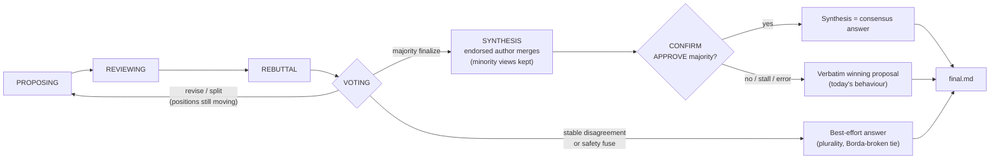

# Ensemble


> **Multi-round: propose → peer-review → rebut → vote → synthesize → converge.**
> Not a one-shot poll — an auditable debate that runs until the models agree on
> a *specific answer* (or provably can't), with every step left on disk.

Multi-model consensus debate via the filesystem. Several top LLMs (OpenAI,
Anthropic, DeepSeek) independently **propose**, **review** each other, **rebut**
the critiques of their own proposal, and **vote** — and, once a majority agrees,
**synthesize** a single merged answer that the group **confirms**. They never
talk to each other directly: every contribution is a file in a shared folder,
and a coordinator advances the debate phase by phase. Participants are
**anonymized** to each other (shown only as "Participant A/B/C"), so they judge
arguments on merit, not on brand.



> Phases `PROPOSING → REVIEWING → REBUTTAL → VOTING` run every round.
> `SYNTHESIS` and `CONFIRM` run **only after a majority finalizes**; deadlocks
> skip them. Alongside its vote, each model may emit a **Borda ranking** of all
> proposals — a recorded signal that only ever decides a *plurality tie on a
> deadlock*, never a real majority.

## Highlights

- 🗳️ **Real consensus, not a poll** — convergence means a majority endorses the
  *same* proposal; otherwise the debate keeps going or provably deadlocks.
- 🎭 **Anonymized peer review** — models see each other only as "Participant A/B/C",
  so arguments win on merit, not on brand.
- 🔀 **Rebuttal phase** — each model answers the critiques of *its own* proposal
  before anyone votes, so minds can actually change.
- 🧬 **Group-confirmed synthesis** — on consensus the endorsed author merges the
  best points (minority views kept) and the group ratifies it; any failure falls
  back to the verbatim winner, so the worst case is never worse than today.
- 📊 **Borda ranking** — a richer per-model signal that breaks deadlock ties
  deterministically (adapted, with synthesis, from [karpathy/llm-council](https://github.com/karpathy/llm-council)).
- 🗂️ **Everything on disk** — every proposal, review, rebuttal, vote, and synthesis
  is a Markdown file; debates are inspectable and fully **resumable**.
- 💸 **Cost-aware** — per-model token + USD accounting, prompt caching, and a hard
  `--budget` cap.
- 🌐 **Grounding & roles** — optional web-search citations and anti-groupthink
  stances (`--ground`, `--roles diverse`).
- 🔌 **CLI + MCP** — a rich terminal UI *and* a one-tool MCP server for Claude Code,
  Cursor, Cline, Kilo, Continue, and friends.
- 🧪 **Measured, not asserted** — a real eval harness (`ensemble-eval`) with a
  strong-model baseline and per-question audit logs.

## Why filesystem?

Each model only reads and writes Markdown files. That makes every step of the
debate a durable, inspectable artifact: you can open any round and read exactly
what each model proposed, how it critiqued the others, and how it voted. A
debate is fully resumable from disk.

## Requirements

- **Python ≥ 3.10**
- API keys for **at least two** of three providers (below)
- *(optional)* a `TAVILY_API_KEY` for web-search grounding

## Install

Ensemble isn't on PyPI yet, so install it from a clone. The `[mcp]` extra also
installs the server used by the editor plugins — include it so you get
everything in one go.

```bash
git clone https://github.com/raiyanyahya/ensemble.git
cd ensemble

python -m venv .venv
source .venv/bin/activate           # Windows: .venv\Scripts\activate

pip install -e ".[mcp]"             # CLI + MCP server
#   ".[mcp,dev]"  also installs pytest + ruff for development
```

This puts two commands on your `PATH`:

| Command        | What it is                                              |
| -------------- | ------------------------------------------------------- |
| `ensemble`     | the CLI (`chat`, `debate`, `list`, `status`, `show`, `resume`) |
| `ensemble-mcp` | the stdio MCP server that editors/agents call           |

Verify:

```bash
ensemble --help
python -c "import mcp"    # no output = the [mcp] extra is installed
```

(Running `ensemble-mcp` launches the stdio server, which then waits for an MCP
client on stdin — that's expected; press Ctrl-C to exit. Editors start it for
you.)

## Configure API keys

Set environment variables for the providers you have (any **two** is enough):

| Provider | Env var             | Default model               |
| -------- | ------------------- | --------------------------- |
| gpt4o    | `OPENAI_API_KEY`    | `gpt-4o-mini`               |
| claude   | `ANTHROPIC_API_KEY` | `claude-haiku-4-5-20251001`  |
| deepseek | `DEEPSEEK_API_KEY`  | `deepseek-chat`             |

```bash
export OPENAI_API_KEY=...
export ANTHROPIC_API_KEY=...
export DEEPSEEK_API_KEY=...   # any two of the three is enough
export TAVILY_API_KEY=...     # optional — enables web-search grounding (--ground)
```

> Put these in your shell profile (`~/.bashrc`, `~/.zshenv`) so they persist.
> Keys are read at call time and never written to disk or logged.

## Quickstart

```bash
ensemble chat                                   # interactive; type a question
# or one-shot:
ensemble debate "Postgres or DynamoDB for a write-heavy event store?" --quick
```

## Use the CLI

### Interactive (`chat`)

The quickest way in — an interactive session where the council debates each
question you type, with a live progress panel:

```bash
ensemble chat                 # quick mode by default (1 round, low latency)
ensemble chat --deep          # full multi-round debates by default
```

In-session commands: `/quick` · `/deep` · `/rounds N` · `/list` · `/help` · `/exit`.

### One-shot (`debate`)

```bash
# Run a single question to consensus (or deadlock)
ensemble debate "Is P equal to NP? Give your best honest assessment."

ensemble debate "..." --quick                 # single round, fast
ensemble debate "..." --rounds 3 --stall-timeout 180 -v
ensemble debate "..." -m claude=claude-sonnet-4-6   # override a model id

# Inspect
ensemble list                 # all debates
ensemble status <debate-id>   # current round/phase + who has contributed
ensemble show <debate-id>     # render the final consensus document
ensemble resume <debate-id>   # continue an interrupted debate
```

### Controls: cost, grounding, roles

```bash
# Cost & budget — every debate reports per-model tokens + estimated $ (prompt
# caching is on, so cached tokens are billed at a discount). Cap the spend:
ensemble debate "..." --budget 0.05            # stop once est. spend hits $0.05

# Grounding & citations — web-search the prompt first; models cite [n], and the
# sources are listed in the final document (needs TAVILY_API_KEY):
ensemble debate "Latest on <topic>?" --ground

# Roles / stances — fight groupthink by assigning perspectives:
ensemble debate "..." --roles diverse          # skeptic / advocate / pragmatist
ensemble debate "..." --roles redteam          # one advocate, the rest skeptics
ensemble debate "..." --role gpt4o=skeptic --role claude="a security auditor"
```

All of these work in `ensemble chat` and via the MCP tool too (`ground`,
`budget` arguments). Cost, sources, and votes all land in `final.md`.

## Use it from your editor / agent (MCP)

`ensemble-mcp` (installed by the `[mcp]` extra above) is a stdio MCP server that
exposes one tool — `ensemble_debate(prompt, quick=true, rounds=5, models=…,
ground=false, budget=null)` — to any MCP client. Make sure your provider keys
are set in the environment the client launches it from.

### Claude Code

Install the bundled plugin (adds the `/ensemble` command **and** the tool):

```text
/plugin marketplace add /absolute/path/to/ensemble     # this repo (or raiyanyahya/ensemble on GitHub)
/plugin install ensemble@ensemble
```

Restart Claude Code, then:

```text
/ensemble Should we shard this table now or wait until 1B rows?
```

Or just ask Claude to "get the council's opinion on …" and it will call the
tool. (The plugin's `.mcp.json` forwards your `*_API_KEY` env vars to the
server.) Details: [`plugins/claude-code/`](plugins/claude-code/).

### Kilo Code

Copy [`plugins/kilo/kilo.jsonc`](plugins/kilo/kilo.jsonc) to
`~/.config/kilo/kilo.jsonc` (global) or `.kilo/kilo.jsonc` (this project), fill
in your keys, and **raise the timeout** — Kilo's 10s default aborts a debate.
Or add it via the UI: Settings → MCP → Add Server → Local (stdio), command
`ensemble-mcp`. Details: [`plugins/kilo/`](plugins/kilo/).

### Cursor / Cline / Roo / Continue / VS Code Copilot

Any MCP client takes the same stdio server — add it in that client's MCP config:

```json
{
  "mcpServers": {
    "ensemble": {
      "command": "ensemble-mcp",
      "env": {
        "OPENAI_API_KEY": "...",
        "ANTHROPIC_API_KEY": "...",
        "DEEPSEEK_API_KEY": "..."
      }
    }
  }
}
```

> A debate is much slower than a single call, so prefer `quick` for interactive
> use and reserve a deep debate (`quick: false`) for high-stakes decisions.

## How consensus is decided

Consensus means agreement on a **specific proposal**, not just willingness to
stop. Each voting round, every active participant casts one vote:

- **FINALIZE: \<participant\>** — endorse the single best proposal *by its label*.
- **REVISE: \<focus\>** — go another round, with a stated focus.
- **SPLIT: \<reason\>** — fundamental disagreement.

The coordinator resolves each FINALIZE to the proposal it endorses and tallies
endorsements (`majority = n // 2 + 1`). **There is no fixed round count** — the
debate runs until the participants settle it:

1. **Finalize** — a majority endorses the **same** proposal → it becomes the
   consensus answer (terminal). Three FINALIZE votes for three *different*
   proposals is **not** consensus.
2. **Stable disagreement** — if a round's votes and endorsements are identical to
   the previous round's, the participants have stopped moving → the debate
   **deadlocks**, writing the *plurality* proposal as a best-effort answer.
3. Otherwise a **revise** majority (or an unsettled **split**) starts another
   round — for as long as positions keep changing.

Two backstops bound a debate that never settles: an optional **`--budget`** cap
on spend, and a high **safety fuse** (`--rounds`, default 50) that's almost never
the actual terminator. If a provider becomes unresponsive mid-debate it's
**dropped** (as long as ≥2 live participants remain) so the debate finishes
instead of hanging; the drop is noted in `final.md`.

### Synthesis & ranking

Both ideas here are adapted from Andrej Karpathy's
[llm-council](https://github.com/karpathy/llm-council) — its **anonymous peer
ranking** and **chairman synthesis** — reworked for Ensemble's multi-round,
consensus-by-vote, filesystem model: the ranking is additive (it only breaks a
deadlock tie, never overrides a majority), and the synthesis is a *candidate the
group ratifies by vote* rather than a single chairman's verdict.

Two signals refine the outcome **without changing the rules above**:

- **Ranking (Borda).** Alongside its vote, each participant may rank all
  proposals best-to-worst (`B > C > A`). The coordinator tallies Borda points and
  records them in `final.md`. The ranking only ever *decides* anything in the one
  case the old logic left arbitrary — breaking a **plurality tie on a deadlock**;
  a real majority is always unique, so the finalize path is untouched.
- **Synthesis-as-candidate.** Once a majority finalizes, the endorsed author
  drafts a single **merged** answer that folds in the strongest points (and
  preserves minority views). Every participant then **confirms** it (APPROVE /
  REJECT). A majority APPROVE ships the synthesis as the consensus answer;
  anything else — a reject, the author erroring, or a stall — **falls back to the
  verbatim winning proposal**, i.e. exactly the previous behaviour. The verbatim
  proposals are always kept in `final.md` below the synthesis for audit. This is
  *not* a single "chairman": the merge is a candidate the group ratifies, and it
  runs only on consensus (deadlocks are unchanged).

#### Two outcomes, same prompt — both paths in the wild

Two live runs on the classic *"Which is larger, 9.11 or 9.9?"* trap landed on the
same correct answer (**9.9**) by two different legitimate routes — a neat tour of
the new machinery. (The route differs run-to-run from sampling, not from a flag.)

**Run A — cyclic endorsement → deadlock → Borda tiebreak.** All three voted
FINALIZE, but each endorsed a *different* peer, a perfect cycle:

```
GPT-4o  → endorsed DeepSeek
Claude  → endorsed GPT-4o
DeepSeek → endorsed Claude
```

Every proposal drew exactly **1/3** endorsements: agreement on the *answer*,
disagreement on whose *articulation* was best, and no majority to settle it. The
debate **deadlocked**, and the 1-1-1 tie for the best-effort answer was broken
**by Borda score** (previously arbitrary) — Claude 4 ▸ DeepSeek 3 ▸ GPT-4o 2.
Synthesis correctly did **not** run (it's finalize-only). Cost **$0.0125**.

**Run B — clean finalize → synthesis → confirm.** This time the endorsements
aligned **3/3 on DeepSeek**, so the debate finalized and the full post-consensus
path ran:

```
VOTING → FINALIZE (3/3 → DeepSeek)
  → SYNTHESIS  (DeepSeek, the winner, drafts the merge)
  → CONFIRM    {APPROVE: 3, REJECT: 0} → synthesis ACCEPTED
```

`final.md` led with the **group-confirmed synthesis** (ending `Final answer: 9.9`,
crediting each participant's strongest point), kept the verbatim proposals below
it, and ranked Borda **DeepSeek 6 ▸ Claude 3 ▸ GPT-4o 0**. The winner made 6 calls
(it authored the synthesis), the others 5; cost **$0.0183**.

Same question, same answer — one run exercised the **deadlock + Borda tiebreak**,
the other the **synthesis + confirm** path, and both handled it correctly.

## A real debate, end to end

Here's an actual run (not a mock-up). Prompt:

> *Should frontier AI labs be legally required to open-source their model weights?
> Give a yes or no and your single strongest reason.*

Three models, anonymized to each other as Participant A/B/C (**A = GPT-4o Mini,
B = Claude Haiku 4.5, C = DeepSeek** — the models never saw these names):

1. **They genuinely disagreed.** In PROPOSING, GPT-4o argued **Yes** (transparency
   and accountability); Claude and DeepSeek both argued **No** (irreversible
   misuse/weaponization risk that audits and regulation can address instead). A
   real 1-Yes / 2-No split, not three models nodding along.
2. **The rebuttal phase changed a mind.** After reading the critiques of its own
   proposal, GPT-4o conceded the security argument and floated a middle ground —
   then, in VOTING, **endorsed Claude's "No" proposal** outright, citing the
   asymmetric-risk reasoning it found persuasive. The lone dissenter was won over
   by the argument — while still blind to *whose* argument it was.
3. **Consensus, by endorsement.** Final tally: Claude's proposal endorsed **2/3**
   (by GPT-4o and DeepSeek); DeepSeek's endorsed 1/3 (by Claude). DeepSeek rated
   Claude's articulation above its own. **Consensus answer: No** — with the
   minority "Yes" still preserved in the record.

Run twice, the verdict reproduced exactly (same winner, same 2/3, same GPT-4o
flip) even at `temperature=0.7` — the prose differed each time, the *decision*
didn't. Cost of the run:

| Model | Calls | Input | Output | Cached | Est. cost |
|---|---|---|---|---|---|
| GPT-4o Mini (OpenAI)        | 4 | 6 749 | 1 028 | 0     | $0.0016 |
| Claude Haiku 4.5 (Anthropic)| 4 | 7 051 | 2 091 | 0     | $0.0175 |
| DeepSeek Chat               | 4 | 5 821 | 1 693 | 1 536 | $0.0031 |
| **Total** | | | | | **$0.0222** |

(Four calls each = propose + review + rebut + vote, one round — they converged
without needing a second. Claude dominates the cost at $1/$5 per 1M tokens and
the longest outputs.) **Note:** this run predates the synthesis step; a converged
debate now adds a synthesis call (endorsed author) plus one short confirm call
per participant — see the table in the next section.

## Artifacts on disk

Debates are stored under `~/.ensemble/debates/<debate-id>/`:

```
<debate-id>/
├── prompt.md            # the question
├── state.json           # full debate state (atomic, resumable) — incl. votes,
│                        #   Borda scores, synthesis_used, confirm tally
├── round-001/
│   ├── gpt4o.proposal.md   gpt4o.review.md   gpt4o.rebuttal.md   gpt4o.vote.md
│   ├── claude.proposal.md  claude.review.md  claude.rebuttal.md  claude.vote.md
│   ├── deepseek.proposal.md  ...   (+ <model>.<phase>.failed if a provider gave up)
│   ├── <winner>.synthesis.md       # only on a finalize: the endorsed author's merge
│   └── <model>.confirm.md          # each participant's APPROVE / REJECT of the synthesis
├── round-002/ ...
└── final.md             # the consensus (or best-effort) answer
```

Each phase writes a **separate** file, so contributions accumulate across
phases rather than overwriting one another. A vote file may carry a `## Ranking`
line (`B > C > A`); the synthesis and confirm files appear only on the finalize
path.

## Evaluation

Does the debate actually beat a single model? `ensemble-eval` puts numbers on it:
each question is answered by every model *solo* and by the *ensemble*, graded by
extracting the model's final answer (the concluding line plus any explicit
`Final answer:` line — not a whole-text substring match, to avoid favouring
longer outputs), and tallied for accuracy and cost.

The honest verdict: **debate matches a strong single model and lifts unreliable
cheap models to that level — but it does not beat a model that is already
reliable, and it costs far more.** The runs below build to that conclusion.

### Latest validated run (15 traps, with synthesis + ranking, 2026-06-04)

After adding the post-consensus **synthesis** step and the **Borda** ranking
signal, we ran `evals/hard.jsonl` — 15 classic single-model traps (9.11 vs 9.9,
the bat-and-ball, the algae lake, "all but 9 die") where cheap models are
individually error-prone. Three cheap models as the ensemble, Claude Sonnet 4.6
as the strong baseline, one round each (`--quick`):

```
Condition            Score  Accuracy       Cost     $/correct
-------------------------------------------------------------
gpt-4o-mini          8/15     53.3%   $ 0.0001    ~$0.00001
claude-haiku-4.5    14/15     93.3%   $ 0.0013    ~$0.0001
deepseek-chat       15/15    100.0%   $ 0.0002    ~$0.00001
-------------------------------------------------------------
BASELINE (sonnet)   15/15    100.0%   $ 0.0058    ~$0.0004
-------------------------------------------------------------
ENSEMBLE            15/15    100.0%   $ 0.2923    ~$0.0195
```

- **The mechanism works.** On *Monday + 100 days → ?*, gpt-4o-mini said Thursday
  and Claude said Friday (both wrong); only DeepSeek had Wednesday. **Two of three
  cheap models were individually wrong, yet the ensemble landed on Wednesday** —
  and the endorsed proposal was *Claude's*, which **revised to the correct answer**
  through review→rebuttal before the vote. Cross-examination corrected an
  individual error; the wrong majority didn't win.
- **Synthesis verbosity vs. graders (found and fixed).** In the first pass the
  ensemble scored 14/15: the bat-and-ball debate reached *unanimous-correct*
  consensus ("the ball costs 5 cents"), but the verbose synthesis *ended* on a
  caveat about the wrong intuitive answer ("…totaling $1.20"), so the last-line
  extractor missed it. The fix instructs the synthesis to close with a
  `Final answer: <value>` line in the requested format — gradable, and clearer for
  a human. The re-run scored **15/15**.
- **The honest caveat.** DeepSeek alone already went 15/15 here, so the ensemble
  **tied** the best cheap single and the strong baseline rather than beating
  them — at **~50× the baseline's cost**. Debate buys *reliability*, not a higher
  ceiling, and only earns its keep when no single available model is already
  reliable. (N = 15, single pass; gpt-4o-mini drifted 10→8 between passes on the
  traps, a reminder these are noisy small-sample numbers.)

### Earlier: the harder run (72 objective questions, single pass)

*This is the run that motivated the work above — kept for the full story.*

`evals/harder.jsonl` is 72 auto-gradeable questions across six categories
(multi-step math, logic, counting/strings, factual edge cases, traps,
arithmetic). Every computable answer is re-derived and asserted in
`evals/build_harder.py`, so a typo'd key fails at build time. We added a **strong
single-model baseline** (Claude Sonnet 4.6) as the comparison that actually
matters — "three cheap models debating" vs "one strong model answering once."

```
Condition            Score  Accuracy       Cost     $/correct
-------------------------------------------------------------
gpt-4o-mini         65/72     90.3%   $ 0.0008    ~$0.00001
claude-haiku-4.5    64/72     88.9%   $ 0.0073    ~$0.0001
deepseek-chat       67/72     93.1%   $ 0.0011    ~$0.00002
-------------------------------------------------------------
BASELINE (sonnet)   70/72     97.2%   $ 0.0247    ~$0.0004
-------------------------------------------------------------
ENSEMBLE            30/72     41.7%   $ 0.6893    ~$0.023
```

Taken at face value the ensemble is a disaster — last place, at ~28× the cost of
the strong baseline. **But that headline is an artifact of one failure mode, not
of bad reasoning:**

- **40 of 72 debates stalled** (38 in voting, 2 in reviewing) and hit the 120 s
  timeout, returning a "no consensus" placeholder that scores wrong. Stalled
  debates were **2.4 %** correct; that single bucket *is* the 41.7 %.
- **On the 31 debates that did converge, the ensemble scored 93.5 %** — and on
  that same subset the cheap singles scored *lower* (gpt-4o 83.9 %, haiku 77.4 %,
  deepseek 87.1 %), while Sonnet also scored 93.5 %. So when the debate actually
  runs, it lifts three cheap models to strong-model accuracy.

### What we can and can't conclude

- We **cannot** yet claim debate beats (or loses to) a single model, because
  this run was gated by a **vote-parsing bug** (since fixed — see below). The
  41.7 % is not a measure of debate quality.
- The "converged" subset is **selection-biased** (questions where models readily
  agree) and small (N = 31), so its 93.5 % is suggestive, not a verdict.
- These questions are **easier than intended**: modern cheap models already clear
  ~90 %, leaving little headroom for debate to demonstrate value. A genuinely
  hard, low-baseline set is needed to see the effect cleanly.

The encouraging signal (debate ≈ strong model, > cheap singles *when it
converges*) only becomes a real claim once convergence is reliable.

### Root cause of the stalls (found and fixed)

Auditing the 41 non-consensus debates via the per-question log pinned the cause
precisely: **45 of 138 vote files contained a valid directive but no `## Vote`
header.** Models obey the instruction "your vote MUST be the first line" and emit
`FINALIZE: Participant B` directly, sometimes dropping the `## Vote` wrapper. The
parser only harvested a vote from a `## Vote` section, so those votes were
silently lost — and because the agent's API call *succeeded*, it wrote no failure
sentinel, leaving the coordinator to wait for a vote that was physically present
but invisible until the 120 s timeout.

The fix makes vote parsing tolerant of a missing/garbled header (recovering the
unwrapped directive line) while `for_phase` still prevents a stray directive in a
non-voting phase from being counted early. Re-parsing the recorded run with the
fix, **all 137 of those vote files now parse, and 45/46 stalled debates would
have reached a vote.** A clean full re-run is the immediate next step before
making any debate-vs-model claim.

### Earlier: when does debate actually add value?

With convergence fixed, we went looking for the case that would justify the cost:
a question where the cheap models are individually unreliable, so debate has
something to correct. Probing all three cheap models (gpt-4o-mini, Haiku,
DeepSeek) on **30 hard, objective problems** turned up a striking fact: **not one
problem stumped all three.** Their errors are *uncorrelated* — each fails on
different questions — so for every problem at least one model was right. (This
also bounds the upside: debate can't invent an answer no member can reach.)

The sharp test, then, is what happens when the lone correct model is *outvoted*
by confidently-wrong peers. On three such problems (a factorial sum, a
squares-or-cubes count, and a cryptarithm), run 3× each:

```
Condition            Score   where ≥2/3 cheap models were individually wrong
----------------------------------------------------------------------------
gpt-4o-mini          0/9
claude               8/9     Ensemble stayed correct in 7/7 such debates.
deepseek             3/9
BASELINE (sonnet)    9/9
ENSEMBLE             9/9     (+11 pts over the best cheap single; ties Sonnet)
```

The ensemble went **9/9, beating the best cheap single** — and the per-question
log shows *why*: on the squares-or-cubes problem only Haiku could solve it solo,
yet in the debate the other two (wrong on their own) read its work and **endorsed
the correct answer**; on the cryptarithm, models that failed solo produced
*correct* proposals once reasoning through propose → review → rebuttal. A wrong
majority did **not** drag the group to a wrong answer in any of the 9 debates.
So debate's value is real and mechanistic: cross-examination corrects individual
errors, not just tallies votes.

**The honest caveat:** a single strong model (Sonnet) also went 9/9, at **~1/6th
the ensemble's cost** ($0.0032 vs $0.018 per correct answer). Debate *matched* the
strong model but never beat it. The defensible conclusion:

- **Debate > best single _cheap_ model** on hard, error-prone problems — genuine,
  mechanism-backed value.
- **Debate ≈ single _strong_ model** on accuracy, at ~6× the cost.
- So debate earns its keep as a way to get **strong-model reliability out of weak
  or diverse models** — not as a way to beat a strong model you could just call
  directly.

(Sample size here is small — 9 debates over 3 questions — a clean signal with a
visible mechanism, but a ≥30-question "cheap-models-unreliable" set is needed to
make it a firm claim.)

### Reproduce

```bash
pip install -e .
export OPENAI_API_KEY=... ANTHROPIC_API_KEY=... DEEPSEEK_API_KEY=...

# the latest validated run (15 single-model traps):
ensemble-eval --dataset evals/hard.jsonl --models gpt4o,claude,deepseek \
  --baseline sonnet --delay 2 --stall-timeout 120 --log run.jsonl

# or the larger 72-question set:
ensemble-eval --dataset evals/harder.jsonl --models gpt4o,claude,deepseek \
  --baseline sonnet --delay 2 --stall-timeout 120 --log run.jsonl
```

`--log` writes one JSONL record per question (every condition's answer, outcome,
cost, and the debate's end status + reason) so any result can be audited and the
stalls inspected. `--baseline` accepts any provider key; `sonnet` is registered
purely as an eval baseline and never joins the default ensemble.

## Development

```bash
pip install -e ".[dev]"
pytest            # unit + end-to-end (no network; providers are stubbed)
ruff check .
```

The end-to-end test in `tests/test_flow.py` drives the real coordinator and
agent loops with fake providers and asserts the full debate converges with all
proposal content preserved.

## Robustness notes

- **Atomic writes** — `state.json` and contribution files are written to a temp
  file and `os.replace`d, so a polling reader never sees a torn file.
- **Retries** — provider calls retry transient failures (429 / 5xx / network)
  with exponential backoff, honoring `Retry-After`.
- **No infinite hangs** — if a phase makes no progress within `--stall-timeout`
  seconds (e.g. a provider is down), the debate ends in a graceful deadlock.
- **Tolerant vote parsing** — a vote is recovered even when the model omits the
  `## Vote` header and emits a bare `FINALIZE: …` / `REVISE: …` / `SPLIT: …`
  line, so a present-but-unwrapped vote can't silently stall the debate. The same
  tolerance covers a bare `APPROVE` / `REJECT` in the confirm phase.
- **Synthesis never undoes consensus** — once a majority finalizes, any failure,
  stall, or rejection in the `SYNTHESIS`/`CONFIRM` phases falls back to the
  verbatim winning proposal. The worst case equals the pre-synthesis behaviour;
  the merged answer is strictly an upside the group can decline.
- **Prompt caching** — the stable system prompt is marked as an Anthropic cache
  breakpoint; OpenAI and DeepSeek cache prefixes automatically. Cached tokens
  are billed at a discount and counted separately in the cost report.
- **Cost accounting** — token usage is captured per call into `*.usage.json`
  sidecars, tallied into `state.json`, and summarized (with estimated $) in
  `final.md`. `--budget` stops the debate before the next round if exceeded.

## Acknowledgments

The **synthesis** and **peer-ranking** steps are adapted from Andrej Karpathy's
[llm-council](https://github.com/karpathy/llm-council), which pioneered the
pattern of multiple LLMs answering, ranking each other *anonymously*, and a
chairman synthesizing a final response. Ensemble reworks those ideas into a
multi-round, consensus-by-vote debate on the filesystem: ranking is an additive
Borda signal (deadlock tiebreak only), and the synthesis is a group-confirmed
candidate rather than a single chairman's call.
